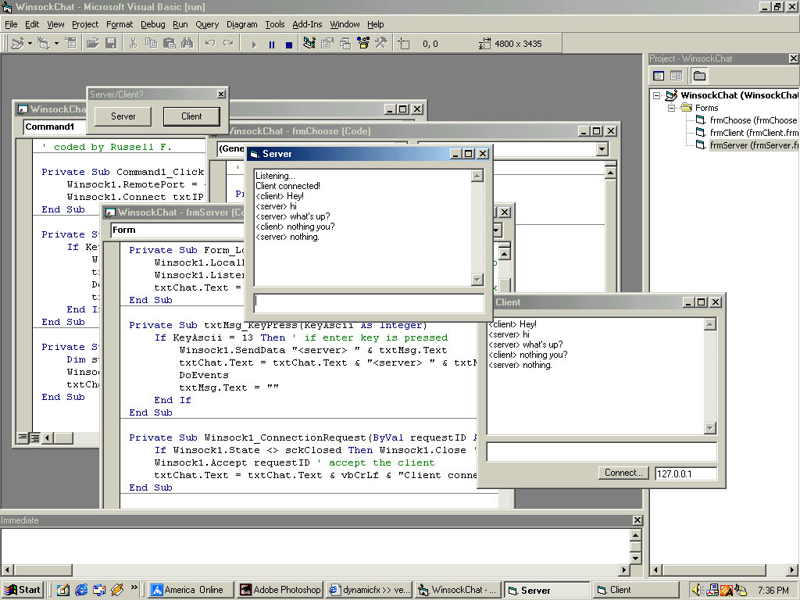



## Basic Winsock Chat

### Description

Well, someone told me to help them with a Winsock chat, so I coded them a basic 1 on 1 chat. I just thought i'd post it up here for anyone that may be struggling or wanting to learn winsock.
 
### More Info
 

             |
---                |---
**Submitted On**   |2002-03-04 19:36:42
**By**             |[Russell F\.](https://github.com/Planet-Source-Code/PSCIndex/blob/master/ByAuthor/russell-f.md)
**Level**          |Beginner
**User Rating**    |5.0 (15 globes from 3 users)
**Compatibility**  |VB 6\.0
**Category**       |[Internet/ HTML](https://github.com/Planet-Source-Code/PSCIndex/blob/master/ByCategory/internet-html__1-34.md)
**World**          |[Visual Basic](https://github.com/Planet-Source-Code/PSCIndex/blob/master/ByWorld/visual-basic.md)
**Archive File**   |[Basic\_Wins59337342002\.zip](https://github.com/Planet-Source-Code/russell-f-basic-winsock-chat__1-32347/archive/master.zip)

